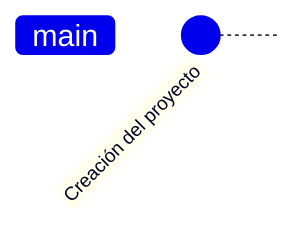

# PreEII

Software de soporte de revisión de pre-matrículas para la escuela de ingeniería industrial
/
Pre-enrollment review support software for the school of industrial engineering

## ¿Qué es PreEII?

PreEII, significa Pre-matrículas de Escuela de Ingeniería Industrial.  
Este software es la evolución de un software que nació por la necesidad
de reducir el tiempo de revisión de las prematrículas. Las primeras
versiones fueron realizadas en Java, que imprimía los resutados en la consola.
Posteriormente se hizo un script en Python 2 que tomaba una plantilla de Excel
que literalmente pintaba los cursos. En esta versión se hacía la revisión uno
por uno, a través del "copy" de los contenidos del informe de cada estudiante
en el navegador. Luego se ejecutaba el "script", que leía el "clipboard" de la
memoria de acceso aleatorio (RAM). Esto aunque ayudaba bastante a la revisión,
resultaba un tedioso.

Por lo que se rediseña una nueva versión, utilizando Python 3. También se mejoró
la generación de la salida, al crear un Excel desde cero sin necesidad de
utilizar una plantilla. Pero el mayor beneficio de esta versión, es que se
digite la credenciales y descarga todos los expedientes asigandos al docente.
Esta versión está diseñada en "consola". Esta aplicación guarda la información
en archivos de texto y archivos de Excel.

## Arquitectura del Software

Esta versión (2.0) ha sido completamente refactorizada siguiendo las mejores prácticas de programación en Python:

### Estructura de Capas

```
src/
├── domain/                 # Capa de dominio
│   └── entities/          # Entidades de negocio
├── application/           # Capa de aplicación  
│   └── services/         # Servicios de aplicación
├── infrastructure/       # Capa de infraestructura
│   ├── adapters/         # Adaptadores externos
│   └── repositories/     # Repositorios de datos
├── presentation/         # Capa de presentación
│   └── console/          # Interfaz de consola
└── shared/               # Componentes compartidos
    └── config/          # Configuración
```

### Principios Aplicados

- **Arquitectura Hexagonal**: Separación clara entre lógica de negocio e infraestructura
- **SOLID**: Principios de diseño orientado a objetos
- **Type Hints**: Tipado estático para mejor documentación y detección de errores
- **Dataclasses**: Uso de dataclasses para entidades inmutables
- **Separation of Concerns**: Cada módulo tiene una responsabilidad específica

## Características técnicas de la aplicación

Este software está desarrollado con:

1. Python 3.8+ con type hints
2. Arquitectura de capas (Hexagonal Architecture)
3. Principios SOLID y Clean Code
4. xlsxwriter para generación de archivos Excel
5. requests para web scraping
6. termcolor para interfaz de consola colorida

## Instalación

### Requisitos previos
- Python 3.8 o superior
- pip (gestor de paquetes de Python)

### Instalación desde el código fuente

```bash
# Clonar el repositorio
git clone https://github.com/mauricio-zamora-ucr/preeii2.git
cd preeii2

# Crear un entorno virtual (recomendado)
python -m venv venv
source venv/bin/activate  # En Windows: venv\Scripts\activate

# Instalar dependencias
pip install -r requirements.txt

# Ejecutar la aplicación
python main.py
```

### Instalación como paquete

```bash
# Instalar desde el directorio local
pip install .

# O instalar en modo desarrollo
pip install -e .

# Ejecutar
preeii
```

## Uso

La aplicación se ejecuta desde la línea de comandos y presenta un menú interactivo con las siguientes opciones:

1. **Descargar expedientes**: Se conecta al sistema de matrícula de la UCR y descarga automáticamente todos los expedientes asignados
2. **Información**: Muestra información sobre la aplicación
3. **Procesar expediente en memoria RAM**: Procesa contenido copiado al clipboard desde el navegador
4. **Salir**: Termina la aplicación

### Archivos generados

- `expediente/`: Contiene los datos descargados de cada estudiante
- `solicitudes/`: Contiene las solicitudes de prematrícula procesadas
- `salida/`: Contiene los archivos Excel generados con el análisis

## Funcionalidades

- ✅ Descarga automática de expedientes
- ✅ Procesamiento de prematrículas desde clipboard
- ✅ Generación de archivos Excel con formato
- ✅ Validación de requisitos y correquisitos
- ✅ Interfaz de consola colorida
- ✅ Arquitectura modular y extensible
- ✅ Type hints para mejor mantenibilidad

Este software está desarrollado con:

1. Python 3.10 (o superior)
2. PySide 6 (QT para Python)
3. SQLite 3

## Roadmap

Este es un resumen de las liberaciones del software.



## Características por implementar

- [ ] Empaquetado del PIP
- [ ] UI: Prueba y diseño de las interfaz general de la aplicación
    1.
        - [ ] Pruebas de QT
    1.
        - [ ] Pruebas de instalación automática en PIP
- [ ] Base de datos
    1.
        - [ ] Diseño de la base de datos
    1.
        - [ ] Carga de datos básicos
    1.
        - [ ] Diseño de triggers de la base de datos
- [ ] Web scrapting
- [ ] Multisede
- [ ] Análisis en pantalla
- [ ] Gráficos en pantalla
- [ ] Multicarrera
- [ ] Reportes en excel
- [ ] Multiusuario

## Resolución de Problemas de Codificación

### Problema
Los archivos de expedientes (.edf) pueden estar guardados en diferentes codificaciones según el sistema operativo:
- Windows: `cp1252` o `latin-1`
- macOS/Linux: `utf-8`
- Sistemas antiguos: `iso-8859-1`

### Solución Implementada
El sistema ahora maneja automáticamente múltiples codificaciones:

1. **Lectura Inteligente**: Intenta leer archivos con las codificaciones más comunes:
   - `utf-8` (predeterminada)
   - `latin-1` (Windows)
   - `cp1252` (Windows extendida)
   - `iso-8859-1` (ISO estándar)

2. **Escritura Compatible**: Los nuevos archivos se guardan en `latin-1` para máxima compatibilidad

3. **Manejo de Errores**: Si todas las codificaciones fallan, usa `latin-1` con reemplazo de caracteres

### Uso
El sistema funciona automáticamente sin configuración adicional. Si ve errores como:
```
'utf-8' codec can't decode byte 0xd1 in position 32: invalid continuation byte
```

Estos ya están resueltos en la versión actual.
